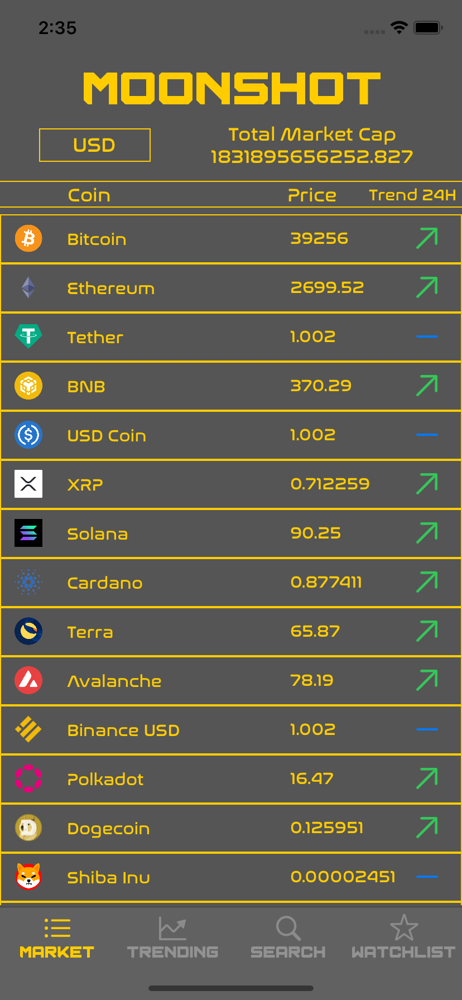
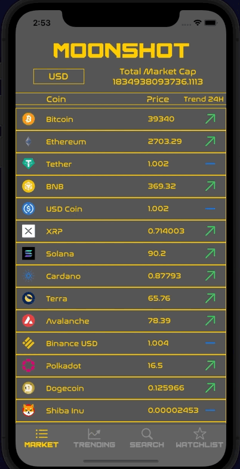

<h1 align="center">

Moonshot :full_moon_with_face:

</h1>

## Objective
Creating a cryptocurrency app programmatically connecting to a third party API [CoinGecko](https://www.coingecko.com/en/api) for up-to-date market information and rates. 
Results will be displayed in a tableView with screen navigation handled by a tabNavigator.

## Progress
- Initial screens created for displaying market data and a watchlist
- List of coins displayed in Market tab
- Coin results now paginating
- Trending Coin Tab now displaying results
- Added Icon Pack
- Watchlist now displaying favourited coins
- Search Tab created
- Mocks created for all functions currently in DataManager
- Added Coin Font
- Standardised Coin cells for Trending, Search and Watchlist Tabs
- Market Cells now showing trends along with current rates
- Using Nuke dependency for loading thumbnails
- Using Charts dependency to load historical coin data for past 7 days
- Individual coin screen now complete
- All Tabs now connnected to coin screen

## Improvements
- UI Testing
- Save features

## Testing (XCT)
13/13 Tests passing

## Installation

1. Clone repository
2. Install cocoapods

## Screenshots

## Demo

## Tech Stack
Swift

## Collaborators
@mattybwoy
